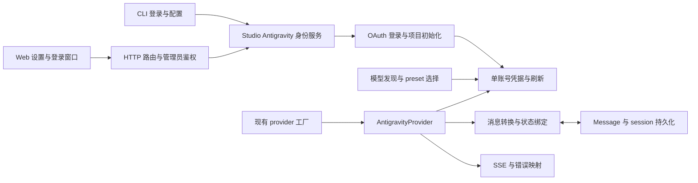

# Google Antigravity OAuth：本地 CLI＋Web 单账号开发方案

日期：2026-09-23。状态：设计方案，尚未实现或用真实账户验证。

本项目调查基线：`9f439ef430d3b0e872aff41748deb931fd828b17`。上游参考固定为 oh-my-pi [`ef6d8b2d0c2af26417c633619d8dcce1cc61a226`](https://github.com/can1357/oh-my-pi/tree/ef6d8b2d0c2af26417c633619d8dcce1cc61a226)。早期可行性报告基于更早的本地提交，本方案已重新检查当前代码。

> 实测更新：本方案初稿之后，已在 Windows＋agy 1.2.8 完成凭据读取、官方 CLI 刷新、项目/模型发现、Gemini 签名工具闭环及 Claude 文本探针。下文“尚未验证”保留为初稿时的调查状态；当前已验证范围与限制以 [探针报告](C:/Users/slapa/.codex/worktrees/antigravity-agy-probe/KohakuTerrarium/docs/zh-CN/dev/research/antigravity-agy-probe-results-2026-09-23.md) 为准。正式 provider 尚未实现。

## 0. 最新调整：优先复用 agy 登录态

用户提出“像 Grok 一样复用本地 agy token，避免本项目实现登录”后，**首选路线改为 A：借用官方 agy 凭据；原生 OAuth 登录作为 B 备用方案。** 下文第 4、5 节的自有凭据存储／OAuth transaction 是 B 的设计储备，不是 A 的首批必做项；第 9 节原来的完整 OAuth 分期也相应以后面的 A 分期为准。模型传输、工具签名、会话恢复和远程边界仍是共同必做部分。

已经核实：本机是官方 `agy 1.2.8`（Scoop 安装）。`--help`、`help models` 未提供 token export/auth 子命令；存在 `models` 命令。官方文档确认 agy 在 Windows Credential Manager／macOS Keychain／Linux Secret Service 中保存并复用登录态。[官方安装与认证](https://antigravity.google/docs/cli/install/)

本项目 [Grok 实现](C:/Users/slapa/workspace/KohakuTerrarium/src/kohakuterrarium/llm/grok_auth.py:1)确实已采用可参考的模式：读取外部 access token，接近到期时调用凭据所有者 CLI 的非生成命令，再重读结果；KT 不使用或回写其 refresh token。Antigravity 可以采用相同的所有权原则，但底层读取方式与刷新触发效果需要单独验证。

公开实现 [`shyim/agm` 的 credstore](https://github.com/shyim/agm/blob/1d3ce8497e36ffa60c3b4e369168315a7ae4d469/internal/credstore/credstore.go#L15)读写 `gemini`／`antigravity` 凭据，Windows 使用 `gemini:antigravity` target；其载荷解析包含 `token.access_token`、`token.refresh_token`、`token.expiry`。这是一手实现证据，**不是官方承诺的稳定导出 API，也未证明本机当前真实账户的 schema 和请求可用性。** 官方 changelog 也记录了 keyring、文件回退、billing project 与提前刷新相关修复，说明必须按 agy 版本维护兼容。[官方变更记录](https://github.com/google-antigravity/antigravity-cli/blob/main/CHANGELOG.md)

更直接的参考是 [`arsenyinfo/nitpicker` 的 token reader](https://github.com/arsenyinfo/nitpicker/blob/b9509442246cdbcf8d5722d483ffe37b44d69cd1/src/gemini_proxy/token.rs#L44)：只读相同 keyring entry，支持 `go-keyring-base64:` 前缀，解析 access token 和 expiry；其 [proxy](https://github.com/arsenyinfo/nitpicker/blob/b9509442246cdbcf8d5722d483ffe37b44d69cd1/src/gemini_proxy/proxy.rs#L102)把读出的 token 用作 loadCodeAssist 的 Bearer，并[请求 streamGenerateContent](https://github.com/arsenyinfo/nitpicker/blob/b9509442246cdbcf8d5722d483ffe37b44d69cd1/src/gemini_proxy/proxy.rs#L395)。因此已存在“借用 agy → 直接模型协议”的代码路径，不只是推测。该实现[过期时要求用户运行 agy](https://github.com/arsenyinfo/nitpicker/blob/b9509442246cdbcf8d5722d483ffe37b44d69cd1/src/gemini_proxy/proxy.rs#L578)，未解决自动刷新。未运行其代码，不能将其实现当作本机端到端验证；也不照搬其中 token 的 Debug 派生或原始错误 body 输出。

### A 的最小设计

| 部分 | 首批选择 |
| --- | --- |
| 首次登录 | 用户在官方 agy 中完成；KT 仅显示操作提示和“重新检测”，不建立自己的 Google OAuth 登录页。 |
| 凭据读取 | 新 `AgyCredentialSource` 只读已知 service/target；Windows 用原生 Credential API，macOS/Linux 采用对应安全存储接口。支持已证实的 JSON／`go-keyring-base64:` 包装，限制大小、严格校验结构、秘密不参与 repr。只返回 access token、expiry、可验证的账户作用域和所需非秘密元数据。 |
| refresh token | 不使用、不另存、不回写。读取完整 keyring blob 可能在内存中遇到该字段，但 source 只提取允许的字段。不要为了复用而迁移或修改 agy 原文件／钥匙串。 |
| 过期刷新 | 优先验证 `agy models` 是否在无人值守、无模型生成的条件下刷新并持久化凭据；成功退出本身不足为证，必须重读并验证 token/expiry。未确认前不能标记为“可自动刷新”。 |
| 刷新协调 | 进程内单飞＋必要时 KT 侧跨进程锁限制重复启动 agy；锁只协调 KT 请求，不能宣称它能锁住用户手动运行的 agy。官方 CLI 仍是唯一 refresh 写入者。 |
| 未登录/过期/存储不可读 | 分别返回 `login_required/auth_expired/credential_store_unavailable`；引导用户打开 agy。禁止在后台偷偷启动浏览器或以 `agy -p` 消耗推理来碰运气刷新。 |
| 项目元数据 | 优先复用已核实的 project 信息；缺失时保留最小 loadCodeAssist 发现。如果还需要 onboarding／验证，提示去官方 agy 完成，A 不代做账户开通。 |
| 模型与推理 | 仍由 KT 的专用 Google provider 完成；不能因为 token 来自 agy 就认为 OpenAI transport 可复用。agy 的模型 slug 也不必然等于 Cloud Code Assist wire ID。 |
| Web | 仿 Grok 状态卡：来源 agy、有效期／刷新状态、重新检测、模型发现。取消 OAuth、callback 与登录 transaction 不再需要。 |
| 断开 | KT 的“停止复用”仅关闭本项目使用、清理本项目缓存；不调用 agy `/logout`，不删除用户官方 CLI 的账户。重新请求前重读来源，源账户改变即失效模型/project/signature 缓存。 |

建议新接口为 `source.status()`、`source.read_access()`、`await source.ensure_fresh(rejected_fingerprint=None)`；provider 依赖这个窄接口，不知道钥匙串细节。必要的 token fingerprint 只作内存比较，不记录明文；账户作用域与 token revision 分开，普通 token 刷新不能误作换账号。未知 auth_method、WIF／enterprise、API-key-only 配置与未知 schema 均显式返回未支持，不能把任意 Google token 当成已验证的 consumer 凭据。

源读取要考虑 agy 的实际存储后端：新版可能回退文件。Scion 的 [capture 实现](https://github.com/GoogleCloudPlatform/scion/blob/1d648e64894e81c94f2960106c1b2b7900721ec7/harnesses/antigravity/capture_auth.py#L58)检查已知 `~/.gemini/antigravity-cli/antigravity-oauth-token`，然后查询 keyring；这提供了文件来源线索，不代表已验证本机 Windows 的选择规则。首批只支持经过 fixture 和实机验证的来源，并测试文件与 keyring 同时存在而一份过期的情况；只支持 keyring 时明确报“CLI 已登录但该存储后端暂未支持”，不要扫描全部凭据目录。Web 服务必须与 agy 登录使用同一 OS 用户及可访问的登录会话；系统服务、容器与远程主机不因“本地 Web”自动获得桌面钥匙串。

请求身份也要按来源验证：Nitpicker 使用 antigravity-cli User-Agent，oh-my-pi 路径采用不同客户端身份。A 的 protocol 模块保留 source-specific request profile，不能仅替换 token 后照搬 B 的全部 headers；实际 scopes、project 与模型资格以探针为准。

### A 的实施顺序与缩减

1. **A0：三个判定性探针。** 验证已知 keyring 记录的脱敏 schema/expiry；验证非生成 `agy models` 的无人值守行为及刷新后落盘；验证借来的 token 可用于目标 loadCodeAssist/fetchAvailableModels 与最小模型请求。当前这些真实凭据/在线探针尚未执行。
2. **A1：本地凭据 source。** 平台读取、版本/schema 检测、状态、单飞刷新、来源变更；以合成 keyring fixtures 验证。优先 Windows 实机闭环，macOS/Linux 同一接口逐平台验收，不以 Windows 成功声称全部平台可用。
3. **A2：共同 provider 与历史合同。** 按第 6、7、8 节实现 Google transport、工具、签名与恢复，并注册 backend；新 auth source 替代自有 token store。
4. **A3：CLI＋Web 状态入口及验收。** CLI 提示官方 agy 登录，Web 状态卡＋重新检测＋模型选择，执行完整对话／工具／恢复测试。凭据自动刷新若未验证成功，则明确要求用户在 agy 中刷新；不在背后启用 B。

A 首批可移除 `antigravity_oauth.py`、自有 refresh-token grant、token 写入/tombstone、浏览器回调服务器、Web 登录 modal/transaction/取消 API；`antigravity_project.py` 缩为只读发现，Studio 身份模块缩为状态／刷新编排。新增 `antigravity_credential_source.py`（以及必要的平台适配）承担读取。第 8 节 API/CLI 改动转为 status／重新检测／模型刷新，不注册不可用的 KT 登录和 Google logout 功能。

**推荐：先走 A，可以明显缩小身份模块和 UI，但不能省掉 Google 协议适配。** A0 若证实 token 不兼容或无法可靠取得，才评估 B；若只有自动刷新未闭环，可以先交付明确的手动刷新限制，不必立即引入完整 OAuth。直接把 `agy -p` 包成 provider 会引入第二个 agent loop 和工具执行器，那属于外部 agent 集成，应另行设计。

## 1. 结论与已确定范围

**建议新增独立的 `google-antigravity` backend，沿现有 LLM → Studio → CLI／HTTP → Web 分层接入。** oh-my-pi 可作为协议参考，不适合整包移植。工程主体是授权、项目初始化、Google 消息协议、流解析和会话状态保存；不是给现有 Gemini backend 换一个 token。

用户已确定：**首批交付本地 CLI＋Web 的单账号接入；远程节点、多账号分期。** 单账号指一个 `KT_CONFIG_DIR` 最多选用一个本机账户；A 的凭据由 agy 维护，B 才由 KT 保存。不等于每个 creature 一份，也不是每个 Web 用户一份。多个本地 creature 可使用同一账户；不同会话的模型输出状态必须隔离。

首批必须覆盖凭据检测／断开复用、刷新策略、模型发现与选用、文本与普通函数工具调用、thinking/signature 回传、会话恢复、切换模型、结构化错误、凭据不外泄；B 才额外承担登录／取消／Google 凭据退出。图片输入仅在模型能力与在线验证都通过后标记支持；图片生成、视频、账户用量面板、自动多账号轮换不在首批范围。不能把“文字问答成功”作为整个接入完成。

此方案延续项目接受可选订阅接入的产品取舍。使用限制与账户风险在功能入口和文档简明说明，不增加反复确认流程，也不作为停止工程设计的理由。已查证的服务条款事实见[可行性报告](C:/Users/slapa/workspace/KohakuTerrarium/docs/zh-CN/dev/research/google-antigravity-oauth-feasibility-2026-09-23.md)。本方案不推导项目提供者必然免责。

## 2. 当前事实如何影响设计

| 事实与证据 | 必须落实的设计 |
| --- | --- |
| [backend 注册](C:/Users/slapa/workspace/KohakuTerrarium/src/kohakuterrarium/llm/backends.py:75)、[Studio 校验](C:/Users/slapa/workspace/KohakuTerrarium/src/kohakuterrarium/studio/identity/llm_backends.py:31)、[provider 工厂](C:/Users/slapa/workspace/KohakuTerrarium/src/kohakuterrarium/bootstrap/llm.py:138)都显式枚举类型 | 同时补齐注册、校验、构造；新分支在通用 API key 校验之前。 |
| Gemini 当前走公开 OpenAI-compatible API；Antigravity 上游走 Cloud Code Assist Google parts 协议 | 新建 `AntigravityProvider(BaseLLMProvider)`，不继承 OpenAIProvider 来伪装协议。 |
| [Message](C:/Users/slapa/workspace/KohakuTerrarium/src/kohakuterrarium/llm/message.py:182)与 [controller](C:/Users/slapa/workspace/KohakuTerrarium/src/kohakuterrarium/core/controller.py:451)已有扩展字段通道 | 可用独立私有字段保存原始签名；无需把凭据塞入历史。 |
| [活动发出](C:/Users/slapa/workspace/KohakuTerrarium/src/kohakuterrarium/core/agent_handlers.py:680)、[活动持久化](C:/Users/slapa/workspace/KohakuTerrarium/src/kohakuterrarium/session/output_activity.py:63)、[事件回放](C:/Users/slapa/workspace/KohakuTerrarium/src/kohakuterrarium/session/history.py:763)使用固定字段白名单 | snapshot 成功不足以证明恢复成功；三处都必须支持新状态字段，并测试 branch/edit/compact。 |
| [OpenAI 出站清理](C:/Users/slapa/workspace/KohakuTerrarium/src/kohakuterrarium/llm/openai_sanitize.py:26)只去除两个已知内部键；LiteLLM 复用该函数 | 新状态字段必须加入清理；切到其他 provider 时不能向上游发送 Google 私有字段。 |
| [BaseLLMProvider.chat](C:/Users/slapa/workspace/KohakuTerrarium/src/kohakuterrarium/llm/base.py:275)的 `stream=False` 分支未转发显式 `tools` 参数 | 新 provider 需保证 `chat(stream=False, tools=...)` 与 `chat_complete` 等价；首批在本 provider 局部覆盖，避免顺带改变所有 provider。 |
| [FileLock](C:/Users/slapa/workspace/KohakuTerrarium/src/kohakuterrarium/utils/file_lock.py:1)已支持 Windows/POSIX 与进程退出释放 | 复用锁原语，无需新增锁依赖；不要只用单个 provider 实例的 asyncio.Lock。 |
| [前端 API 层](C:/Users/slapa/workspace/KohakuTerrarium/src/kohakuterrarium-frontend/src/utils/api.js:105)统一注入 L2/L3/L4 鉴权头 | 新 Web 登录走现有 Axios 请求层与短轮询；避免另外维护裸 fetch 鉴权。 |
| [节点适配器](C:/Users/slapa/workspace/KohakuTerrarium/src/kohakuterrarium/laboratory/adapters/terrarium_runtime.py:158)会预取远程 profile/凭据 | 首批要明确拒绝远程使用，不能无意进入通用 API-key 预取或回退到 host 凭据。 |

离线探针已证实：合成 `_kt_antigravity_content` 能穿过 `Message → Conversation.snapshot_messages()`；当前 OpenAI 清理函数会保留它；当前事件回放会丢失它，同时正常保留已知 reasoning 字段。这是新功能的实际接入缺口，不是对现有 Antigravity 功能的故障报告——当前根本没有该功能。

## 3. 方案选择与模块边界

| 路线 | 判断 |
| --- | --- |
| 直接复用 Gemini/OpenAI backend | 协议、projectId、签名和错误处理均不匹配，排除。 |
| 引入 Node sidecar 或完整移植 oh-my-pi 认证引擎 | 引入第二运行时、多账号与租约系统，超出首批需要。 |
| Python 原生、独立 provider、沿用现有身份分层 | **采用。** 复用 httpx、FileLock、Message、ToolSchema、preset 与 Studio；只移植必要协议。 |
| 同时重构 Codex/Grok 成通用 OAuth 框架 | 暂缓。当前应先建立第三种真实实现，再识别可共享部分。 |



下层 `llm/` 不依赖 Studio、CLI、FastAPI 或 `api/auth/`。Studio 编排登录任务与状态；API 层负责 Web 权限和请求边界；CLI 与 Web 消费同一身份服务。OAuth 是模型凭据，不是 KT 的 Web 登录身份。

以下是包含 B 备用认证路线的完整模块地图；A 按第 0 节删去自有 OAuth／凭据写入模块，替换为只读 credential source。采用当前平铺命名习惯，单文件以 600 行以内为目标。表中的路径和接口均为拟新增，并非已经存在。

| 拟新增文件（相对 `src/kohakuterrarium/`） | 内聚职责／主要接口 |
| --- | --- |
| `llm/antigravity_protocol.py` | 固定 endpoint、OAuth client 协议参数、兼容版本、typed errors；不包含用户 token。 |
| `llm/antigravity_auth.py` | `CredentialStore.status/read/commit/logout`；`get_valid_credentials(force_refresh=False, rejected_revision=None)`；文件锁、原子写、刷新。 |
| `llm/antigravity_oauth.py` | `login(on_progress, callback_input, cancel)`；loopback listener、state、exchange；不负责浏览器 UI。 |
| `llm/antigravity_project.py` | `resolve_project(access_token)`；load/onboard/poll、资格错误与验证提示。 |
| `llm/antigravity_format.py` | `build_request(...)`、tool/schema 转换、raw parts 的作用域与完整性检查。 |
| `llm/antigravity_stream.py` | 增量 SSE 解码、Google response 归一化、签名/usage/tool-call 累积。 |
| `llm/antigravity_models.py` | 显式异步发现、缓存、wire ID/alias/thinking 能力映射。 |
| `llm/antigravity_provider.py` | `AntigravityProvider`：chat/chat_complete/with_model/reload_credentials；一次请求的取消、重试、资源释放。 |
| `studio/identity/antigravity_oauth.py` | 登录 transaction 生命周期、脱敏 status、logout、模型刷新；供 CLI/API 调用。 |
| `cli/identity_antigravity.py` | 浏览器打开、授权 URL 展示、手动 URL 输入、退出码；无凭据序列化代码。 |
| `api/routes/identity/antigravity.py` | 参数校验、权限、仅 host 限制；不直接操作 token 文件。 |

内部允许向 auth/provider 注入 `httpx.AsyncClient`、时钟与凭据目录，以替代真实外部 I/O；这些不是暴露给产品用户的配置项。生产调用接口仍保持简单。

## 4. B 备用：自有凭据生命周期与并发

建议文件为 `config_dir()/antigravity_auth.json`，另有持久 sidecar `.lock`。记录包含 `schema_version`、`generation`、`revision`、`credentials | null`；凭据内含 access/refresh token、原始 `expires_at`、projectId、非秘密账户标识及可选 email。秘密字段不参与 repr/log/status。状态接口不返回原始 token、授权码或完整原始响应。

- `generation` 在登录替换和 logout 时改变；`revision` 在每次成功写入时递增。logout 写入不含秘密的 tombstone，不能仅删除文件后让计数归零。
- 读取凭据必须遵循同一个 config root；状态查询与 provider 构造不联网、不启动浏览器。`available` 仅代表本地有完整且可尝试使用／刷新的凭据，不能显示为“服务已验证可用”。
- 新鲜 token 直接使用；接近到期时提前 5 分钟刷新。若保存真实 expiry，就只在比较处应用一次提前量，避免重复提前。
- 刷新：取得跨进程 FileLock → 重读记录 → 检查是否已被另一调用刷新 → 有界 HTTP refresh → 校验结果 → 原子替换记录 → 释放锁。异步等待锁使用 `asyncio.sleep`，不能照搬同步 `time.sleep` 阻塞事件循环。建议初值：锁等待 45 秒、单次刷新总时限 30 秒，均可内部测试覆盖。
- 为单账号简化，上述锁覆盖短暂刷新 HTTP；不移植多账号租约和续租系统。CLI/Web 同时刷新只能一方真正发请求。401 强制刷新带 `rejected_revision`，若磁盘已有较新 revision，应先使用新凭据，避免连续无意义刷新。
- logout 同样取得锁并写 tombstone；完成后所有 provider 在下一次请求读取 generation，拒绝旧内存凭据。已发出的上游请求可能完成；本地退出不等同于 Google 服务端撤销授权。
- 登录等待浏览器期间不持凭据写锁。开始记录 generation；exchange＋project 成功后，持锁比较 generation 再提交。logout 或另一次登录替换后，旧事务不得恢复账户。取消与提交使用事务状态锁确定先后，已经完成的登录不能伪报为“取消且未保存”。
- refresh 返回新 refresh token 时替换，否则保留旧值；登录首次 exchange 缺少 refresh token 不宣称成功。`invalid_grant` 标记需要重新登录，只能修改自己读取的 revision，避免覆盖新登录。
- 临时文件与目标同目录，写完 flush 后原子 `os.replace`；失败保留上一份可用记录。POSIX 限制权限；Windows 使用用户配置目录的访问权限，单独验证 ACL 行为，不能声称 `chmod(0600)` 就等同 Windows ACL 保护。

多个事件循环不共享一个未经约束的 asyncio.Lock；文件锁是跨进程事实来源。本地单飞只是减少竞争。进程崩溃后锁由 OS 释放，但上游刷新成功、落盘前崩溃仍可能需要重登；本方案不承诺网络和磁盘间的 exactly-once。

## 5. B 备用：登录流程与 CLI／Web

上游使用授权码流程、Google OAuth endpoint、Antigravity client 配置、固定 loopback 回调和项目初始化；当前声明式规则未开启 PKCE。**不把它写成 device-code 或已验证的 PKCE 流程。** OAuth client 和服务身份参数集中放在 protocol 模块，记录来源与版本；自建 Google OAuth client 能否访问目标服务尚未验证，不作为首版默认路线。若移植源码片段，保留对应 MIT 版权与许可声明。

流程：创建事务 → 绑定 `127.0.0.1:51121/oauth-callback` → 生成授权 URL/state → 用户授权 → 验证回调 → exchange → loadCodeAssist／必要时 onboardUser 并轮询 → 得到有效 projectId → 原子保存。授权成功但项目初始化失败，事务仍是失败，不能亮“已连接”。不生成虚构 projectId。

回调要求：只监听 loopback；限制方法、路径、请求大小；强随机 state、恒定时间比较、一次消费；OAuth error 也须验证 state。手工输入只接受**完整回调 URL**，检查 scheme/host/port/path、必填且不重复的 state/code/error；拒绝裸 code、非预期 URL、重复消费、过期事务。无需在 HTTP 层启用任意来源 CORS。

端口已被占用时明确报告错误，不自动发送用户授权码到占用端口，不擅自换成未经验证的 redirect URI。无图形浏览器但 loopback 可用时展示 URL 并允许手动打开；手工 URL 提交是同机回调未完成时的辅助，不据此承诺远程登录支持。CLI 监听不能被同步 stdin 读取阻塞；取消时必须释放 listener 与输入等待资源。

建议 CLI 产品接口（均为拟新增）：

```text
kt login google-antigravity
kt config antigravity status
kt config antigravity models --refresh
kt config antigravity logout
```

既有 `kt config login google-antigravity` 同样分派到新流程。登录不自动修改全局默认模型；模型命令给出发现列表，用户通过既有 preset 配置选用。`--no-browser` 可作为新登录选项，同时更新顶层和 config 两个 parser。非交互运行缺少凭据时返回“请先登录”，不在 creature 执行中弹浏览器或阻塞 stdin。

### Web API 合同（拟新增）

采用短请求与轮询，前缀 `/api/settings/antigravity`；初始 poll 1 秒、总登录有效期建议 5 分钟。所有 transaction 接口与含账户细节的 status 都要求现有管理员鉴权；公开 provider 列表最多包含可用布尔值。

| 方法／路径 | 行为 |
| --- | --- |
| `GET /status` | 脱敏 `auth_state`、expiry、masked email、project 是否就绪、`local_only=true`；不 refresh。 |
| `POST /login` | 创建有随机 ID 的事务，返回 `id/state/auth_url/expires_at`；这里 `state` 是流程阶段，不返回 OAuth state 独立字段。已有活跃事务则 409，不暗中替换。 |
| `GET /login/{id}` | 返回 `waiting_callback/exchanging/resolving_project/completed/cancelled/expired/failed`、安全错误码及可选验证链接；不含授权码/token。 |
| `POST /login/{id}/callback` | JSON `callback_url`；与 loopback 共用验证和单次消费逻辑。 |
| `DELETE /login/{id}` | 取消任务，等待清理 listener，返回实际终态；不得误取消新事务。 |
| `POST /logout` | 取消本服务的待登录事务、更新凭据 generation、清除模型缓存／可用状态。 |
| `GET /models` | 返回缓存和 `fetched_at/stale`，不隐式联网。 |
| `POST /models/refresh` | 明确触发发现，可刷新凭据；失败保留旧缓存并返回失败原因。 |

所有入口对 worker `node` 明确返回 `unsupported_remote_provider`（建议 HTTP 400）。OAuth 上游认证错误用结构化业务错误表达，不能冒用带 `X-Auth-Required` 的 KT Web 登录错误；推荐上游失效 409、资格不足 403、网络／协议失败 502、超时 504，错误 body 含稳定 `code`。

transaction 由 Studio 服务对象持有，绑定其事件循环，应用 lifespan 结束时显式 `aclose()`；不使用永久模块级任务。首版支持单 API worker 进程。多个 API worker 需要共享事务路由，留作后续；多进程 CLI／服务之间的**凭据刷新**仍受文件锁协调。

浏览器切换 host/node 或关闭 modal 时取消原事务，固定向创建时的 host 发送取消请求；不能用已切换的 activeHost 误操作新主机。窗口关闭时无法保证请求送达，后端 TTL 最终释放资源。所有结果设置不缓存，不写入 localStorage；日志不记录完整授权 URL／callback body。验证链接只允许经检查的 HTTPS 目标，通过用户主动打开完成，不自动代做验证。

界面新增 Antigravity 登录 modal 和设置项：未连接→登录→授权等待→项目初始化→已连接；提供取消、刷新模型和退出。显示“本机共享账户”，worker 选择时显示未支持。复用现有 Axios 鉴权及登录提示；不复用 Codex 的 device-code 文案。功能说明一次性展示简洁的非官方接入与账户风险说明，不每次请求弹窗。

## 6. 模型、配置与可用性

规范名称统一为 `google-antigravity`，用于 backend name/type/provider identity；界面显示 `Google Antigravity`。只提供一个内置账户入口，不在首版自定义 backend 表单开放多个同类型别名，以免伪装出多账号支持。空 base_url/API-key 配置由 backend 规则校验；拒绝把 token 当 key 保存。`api_keys` 列表可返回 OAuth 类型状态，但不能给出“编辑 API key”操作，服务端 `set_key/remove_key` 也须拒绝并指向专用操作。

模型使用账号实时 `fetchAvailableModels` 结果，保存非秘密缓存，按账户 generation/project 隔离。不能在 `list_all()`、profile 解析或普通 `kt doctor` 中发网络请求。登录成功后可独立发起模型刷新；发现失败不撤销已成功登录，但页面应明确“已登录，模型列表未获取”。

缓存区分发现 ID、展示名、wire model ID、已知能力、来源和时间。上游 alias、thinking effort、输出限制集中映射在 `antigravity_models.py`，不要散落在前端和 provider。未知模型可展示，但在能力未确认前不标为已支持；不借用 `LLMPreset` 的通用默认值来声称上下文和输出上限。发现结果没有的限制，由已验证兼容表补齐；仍未知时要求明确配置或标记实验性，不能静默猜测。

首批支持普通文本、JSON function tools 和可用的 thinking 模式。若目标账号实际提供 Gemini 与 Claude，两类各完成独立验收才对外声明支持；不能由 Gemini 成功推导 Claude 成功。普通函数工具与框架 `provider_native_tools`（图片生成等）是两套能力，后者初始为空。

模型发现后通过现有 preset 服务创建 `google-antigravity/<preset>`，Web 的 PresetEditor 选择发现 ID、支持的 effort 与容量；CLI 使用相同数据。持久配置继续沿现有 nested preset 格式，不新增第二份 profile 系统；不自动覆盖用户 preset 或默认模型。

## 7. Provider、签名和恢复合同

请求：Bearer 凭据＋必要客户端头；外层 `project/model/requestId/requestType/userAgent`，内层 Google `contents/systemInstruction/tools/generationConfig/sessionId`；目标为上游当前 Cloud Code Assist SSE endpoint。兼容头／客户端版本在 protocol 模块集中维护，首版不增加每次请求联网查询版本的依赖。不支持的 `extra_body` 参数明确拒绝，不照单传递 OpenAI 字段。

响应：逐帧解析 UTF-8 与 SSE `data:`，支持网络分片、CRLF、空行、注释及可选多行 data；归一化 response 包装、candidates/parts、finish reason、usageMetadata。区分合法的工具调用／签名输出与真正空响应；未完成的截断流报错，不能当正常终止。usage 的累计值按上游语义替换，不能每个 chunk 重复相加；额度、金额和 token usage 分开表达。

`_kt_antigravity_content` 拟存 `{version, provider, wire_model, account_scope, canonical_digest, parts}`。只保存后续请求必要的模型 parts，禁止混入 authorization、账户 token 或整份 HTTP response。`account_scope` 是不含凭据的本地账户作用域；重新登录时保守失效旧作用域。展示用 thinking 另走既有 `_kt_assistant_segments`，原始 parts 不承担 UI 展示职责。

关键规则：

1. thoughtSignature 可附在 text、functionCall 或仅签名 part 上；不能只存 thought=true 的文字。工具 ID 与同名多次调用须稳定区分，结果按上一 assistant 中的调用顺序与数量完整配对。
2. raw parts 仅在 provider、wire model、account scope 以及 canonical content/tool_calls 摘要一致时重放。摘要覆盖实际送出的规范化内容；编辑、插件改写、截断或孤立工具清理后不重放旧签名，也不靠 raw parts 复活已被删除的工具调用。
3. 切 provider／model、压缩或恢复旧无状态会话时，转换为当前模型支持的普通历史。如果该模型对已有签名工具回合无法安全转换，给出可操作的“不兼容历史，需新建／压缩会话”错误。不能伪造签名、偷偷删掉整段用户历史，或因签名错误自动重复有副作用的工具。
4. 首版在现有三处事件白名单增补新字段，保持 snapshot 与 event replay 一致；只含 signature/tool、没有可见文字的 assistant 也必须有可关联的回合状态。事件需绑定准确 assistant 回合，测试多个 LLM round 时不能附着到前一条消息。
5. OpenAI/LiteLLM 清理新私有键；Anthropic/Codex 的转换器验证不会发送它。Google 请求由白名单构建，不透传其他 provider 的 reasoning 私有状态。
6. `chat_complete` 复用同一流解析器收集结果，统一 tool calls、usage、finish reason；`chat(stream=False)` 显式转发 tools。`with_model` 共享凭据服务但不共享输出累积器；每次请求重置 `last_*`，避免失败回合暴露前一回合结果。

错误与恢复策略：

| 情况 | 首版动作 |
| --- | --- |
| 无凭据、invalid_grant、项目/资格/验证要求 | typed error＋明确下一步；不自动启动交互登录，不按网络错误重试。 |
| 401 且尚未向调用方交付结果 | 至多强制刷新一次，按 rejected revision 协調，再尝试一次。 |
| 429、可恢复 5xx、连接故障 | 有界次数、总截止时间与 Retry-After；累计在同一个预算中，不让刷新/空响应/endpoint fallback 各套一层无限放大。 |
| 已输出 text/thinking/tool 增量后中断 | 报部分结果失败；禁止透明重播。内部 retry 的“已输出”边界覆盖所有对外可见事件，不只字符串。 |
| 400 schema/signature/model、403 forbidden、context overflow | 分类型返回；不使用“所有无 status 异常都是 transient”的通用兜底。 |
| 用户取消／超时 | 关闭 HTTP response、listener、任务，释放锁；不重试，不提交取消后的凭据。 |

endpoint fallback 仅允许已审核的上游主机，且发生在未交付输出前；无需求就不开放任意 base_url。这样也避免 OAuth Bearer 被用户误配置到通用 OpenAI 代理。工具执行后不因后续模型失败重复工具回合；重试只针对当前尚未交付的模型请求。

## 8. 修改地图与远程边界

以下既有文件需要有目的地接线或补齐合同，而不是全面重构。

| 现有位置 | 修改内容 |
| --- | --- |
| `llm/backends.py`、`studio/identity/llm_backends.py`、`bootstrap/llm.py` | 内置名称、支持类型、专用构造分支、无 key 路径、兼容字段校验。 |
| `llm/profiles.py`、`studio/identity/api_keys.py` | 离线可用性；OAuth 状态与 API-key CRUD 区分；保持默认 provider 不变。 |
| `cli/auth.py`、`cli/_main.py`、`cli/config.py` | 两个 login 入口、选项和新 status/models/logout 子命令。 |
| `cli/identity_backend.py`、前端 `BackendForm.vue` | 内置 Antigravity 的字段显示与保护；不开放多账号式别名，不把它变成通用 key backend。 |
| `api/app.py`、identity 路由注册 | 注册新路由、初始化/关闭 Studio transaction 服务。 |
| `core/agent_handlers.py`、`session/output_activity.py`、`session/history.py` | provider 状态事件的写入／回放与准确回合关联；若无文本消息无法绑定，补专用状态事件或稳定 round locator，先由负例确定最小修改。 |
| `llm/openai_sanitize.py` | 出站清理新私有键；同时验证 LiteLLM 与 Responses 路径。 |
| 前端 `SettingsPage.vue`、新增 `AntigravityLoginModal.vue`、`PresetEditor.vue`、`utils/api.js`、语言资源 | 登录状态、轮询/取消、选模型、host 切换、错误和中文/英文文案；不手改 web_dist。 |
| `laboratory/adapters/terrarium_runtime.py` 与调用它的 session 创建／模型切换入口 | 远程能力拒绝：须在实际 profile/inline 配置解析后检查，涵盖 spawn、resume、switch_model，且异常不能被 best-effort 预取 catch 吞掉。 |

首批远程节点策略：API identity 对非 host 拒绝；Studio 将任务派给 worker 前检查；worker 适配器再次验证最终 backend_type。包含配置继承、inline model、远程 preset 与 resume，不能只检查 UI 选项或字符串前缀。不为 Antigravity 新增凭据 RPC，也不从 host 广播 refresh token。远程本机自行运行 CLI 属于独立配置目录使用，不等于已支持 KT 远程节点管理。

## 9. B 备用的开发顺序（A 优先顺序见第 0 节）

| 阶段 | 产物与出口条件 |
| --- | --- |
| P0：协议样本与能力核实 | 固定上游版本；整理脱敏 HTTP/SSE fixtures；确认账号实际模型、headers、工具/签名样本；真实验证失败需记录具体环节，离线实现可继续。 |
| P1：认证与独立 provider | 实现 store/login/project/format/stream/provider；通过 `Agent.build(..., llm=provider)` 验证，无需先注册全部 UI。离线覆盖登录并发、refresh/logout、工具回合、错误与取消。 |
| P2：配置、历史与 CLI | 注册 backend、模型/preset、CLI 登录退出；补齐事件与 snapshot 状态、跨 provider 清理；真实 CLI 完整工具对话＋退出恢复通过。 |
| P3：本地 Web | 登录 transaction 与管理员权限、modal、发现选模、取消、换 host；本地 Web 完整 journey 与构建通过；远程拒绝路径可复现。 |
| P4：首批验收与文档 | 离线矩阵＋实际账户验证结果齐全，明确支持模型/模式；保留 MIT notices；更新使用与排错文档；审查 diff 与负例后交付。 |

后续远程阶段先决定凭据所有权：优先 worker 本地登录／刷新，host 仅获取状态；若要 host 代理推理或受控凭据委派，单独设计。多账号阶段再引入账号选择、每账号 project/cache、租约、额度与公平调度，不能在首批用全局换 token 假装实现。

## 10. 验证矩阵

遵循[仓库测试规范](C:/Users/slapa/workspace/KohakuTerrarium/tests/README.md)：新增模块各有对应 unit；integration 扩充既有完整 workflow；本地跑 Studio／HTTP e2e。替身只放在真实外部 HTTP/浏览器/时钟/文件边界，内部 auth→store→provider→session 使用真实协作者。

| 边界 | 必须证明的行为 |
| --- | --- |
| OAuth | 自动和手工完整 URL、state 缺失/错配/重复参数、OAuth error、端口占用、重复回调、超时、取消、缺 refresh token、项目未就绪、验证要求、listener 清理。 |
| 凭据 | 多 coroutine／两个进程同时刷新只有一次远程交换；刷新期间 logout 后不复活；取消等待锁；刷新 token 轮换；原子写失败；截断 JSON；进程退出锁释放；配置目录隔离。 |
| Google 协议 | text、thinking、signature-only、多个同名工具、结果重排、JSON schema 拒绝、finish reason、累计 usage、SSE 分片/多行/截断、空 candidates、部分输出后断流。 |
| 模型与恢复 | cached list 不联网；账号更换失效缓存；未知模型/effort 不假装支持；Message、snapshot、event replay、resume、branch/edit、compact、切其他 provider 均不丢失或泄漏错误作用域的状态。 |
| API/Web | 未授权不能开始/读取/取消他人事务；host/node 切换；cancel 与 commit 竞态；关页 TTL；过期 ID；模型刷新失败不伪报登出；无原始 token；单 API worker 限制明确。 |
| 远程拒绝 | worker 的 preset/inline/inherited/resume/switch_model 均得到稳定“不支持”错误，而非通用 key missing／静默改用 host 凭据。 |

具体复用位置：`tests/integration/test_llm.py::TestLlmIntegration` 的 `test_define_save_reload_resolve_profile_workflow`、`test_multimodal_message_round_trip_workflow`；`tests/integration/test_studio.py::TestStudioIntegration.test_identity_and_catalog_surface`；`tests/integration/test_auth_workflows.py::TestAuthIntegration.test_full_lifecycle_register_login_mutate_rotate_logout`。新协议 I/O 的完整流程若无法自然放入上述方法，应在同一核心目录对应 class 增加完整 workflow，而不是拆成零散步骤。

本地 e2e 扩充 `tests/e2e/test_api_settings.py` 的 `test_full_settings_round_trip` 与 `tests/e2e/test_prog_studio.py` 的 `test_identity_and_attach_journey`，并覆盖 Web 对话／恢复 journey。unit 包括新模块及被修改的消息／事件／清理／API 文件；前端为 modal 与 SettingsPage/PresetEditor 增加行为测试。实施时运行受影响各层、文件大小与依赖门禁、black/ruff、前端 `format:check`、相关测试和 build；发现遗漏先补失败用例再修正。

真实账户验收单独记录：Windows 本地 CLI 和同机 Web 各跑一次登录→发现→选模型→两轮对话→函数工具→恢复→刷新→退出；每个宣称支持的模型族至少一个代表，含 thinking 与 signature-only 实际样本（如能产生）。不把 CI 的固定 HTTP fixtures 当成上游当前可用证明，不在测试日志保存 token。当前未执行这些在线验收，也未产生订阅请求费用。

## 11. 实施状态（2026-09-24）

A 路线已实现于 `codex/antigravity-agy` 独立 worktree：Windows 官方 agy consumer 凭据复用、由 agy 续期、固定 Google 传输、Gemini/Claude 文本与函数调用适配、签名历史持久化/回放/恢复、CLI 命令及 Web 管理卡片。没有新增 KT OAuth 登录或 refresh token 存储。

首版收敛范围与用法见[接入指南](../../guides/antigravity.md)。模型列表按显式操作获取；没有增加长期模型缓存。macOS/Linux、远程节点、多账号、显式思考参数和任意 extra_body 不在本版支持范围。带工具历史跨模型切换如果无法安全复用签名，会明确要求新建或压缩会话；不伪造签名。

原方案中自建 OAuth、账户存储与 callback 的设计保留为历史研究，不属于此次交付。在线探针结果已记录在[探针报告](antigravity-agy-probe-results-2026-09-23.md)。本次实现没有追加在线推理；此前授权的三次小型推理已全部使用。

验证结果：受影响的 Python 单元/集成/Studio e2e 及依赖、文件大小门禁合计 4,288 passed、4 skipped；最后的 CLI/API 错误处理修正再单独通过 12 项测试；前端设置组件 16 项测试通过，完整 Prettier 检查与生产构建通过。全仓 Ruff 与 Black 检查通过。完整 agent 测试使用离线 HTTP 边界，真实执行 scratchpad 工具、保存签名并恢复会话继续调用。

仍待真实账户验收：生产 provider 的完整 CLI/Web 操作链及 Claude 工具/思考组合。已有在线探针证明协议路径可行，离线测试证明实现路径与回归边界；两者不等同于完整产品在线验收。


## 12. agy 1.2.9 模型与 reasoning 对齐（2026-09-24）

后续实现增加 Gemini 3.6/3.7/3.8 Flash、Gemini 3.1 Pro 和 Claude Opus 4.6 Thinking，
并将 Sonnet 4.6 的限制更新到发现值。KT 既有 reasoning variation 开放 Flash 三档、
Pro 两档；两个 Claude 按官方 agy 能力保持固定 Thinking。原 Gemini 3 Flash 预设
继续兼容旧配置。详细限制、请求路由、会话边界及 3,368 项后端／32 项前端验证结果见
[模型对齐记录](antigravity-agy-models-2026-09-24.md)。
